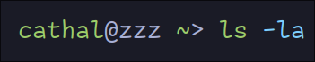

# No My Zsh
No My Zsh is a 42 line long shell script that both sets up plugin management and installs
syntax highlighting and auto suggestions.

## Quick Usage
**Note** this will back up any files it overwrites postfixing them with `.bak`
```sh
curl -L https://raw.githubusercontent.com/leath-dub/nomyzsh/master/install.sh | sh
```
Yeah thats it ! this will result in a shell that looks like so


### Install to ~/.config/zsh ?
```sh
TEMP_FILE=`mktemp`; curl -L https://raw.githubusercontent.com/leath-dub/nomyzsh/master/install.sh > $TEMP_FILE && sh $TEMP_FILE --xdg
```

## How do I add more plugins ?
Its simple ! if you ran the install script there is a function `plug` in your `.zshrc` that
can be used to bootstrap plugins. The default config from the `install.sh` script has 2
plugins already there
```sh
plug "zdharma-continuum/fast-syntax-highlighting" "fast-syntax-highlighting.plugin.zsh"
plug "zsh-users/zsh-autosuggestions" "zsh-autosuggestions.plugin.zsh"
```
`plug` takes 2 arguments, `<github user>/<repository name>` and `<path to plugin entry point relative to git repo>`

## Is this a Joke ?
Kinda. I find it funny that people use `oh-my-zsh` but also painful as plugins are actually incredibly simple
in zsh. This repo is also not necessary but it does automate it such that the barrier to entry is just
as low as `oh-my-zsh`, hopefully this project will stop the madness.

## Contributions
Open an PR or an issue, please tell me how I am wrong. This project is MIT licensed so feel free to
use it Elon !.
